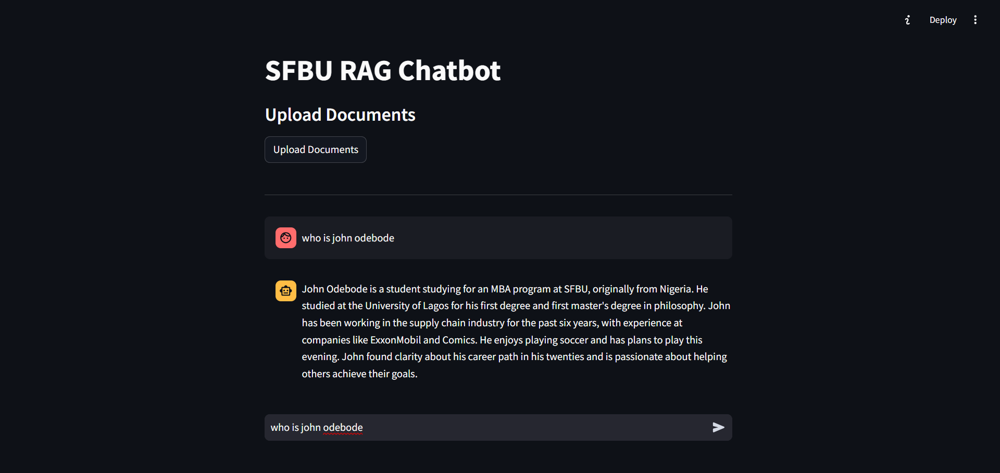

# RAG Chatbot App

A Retrieval-Augmented Generation (RAG) Chatbot app built using LangChain, OpenAI, Chroma, and Streamlit. This chatbot answers user questions based on uploaded documents, ensuring responses are directly relevant to the provided content.


## Table of Contents

- [Overview](#overview)
- [Features](#features)
- [Technologies Used](#technologies-used)
- [Prerequisites](#prerequisites)
- [Installation](#installation)
- [Usage](#usage)
- [Demo](#demo)
- [Contributing](#contributing)

---

## Overview

This project demonstrates a document-based chatbot that enables users to ask questions about uploaded documents, with responses generated from the context of the documents only. By leveraging a retrieval-augmented generation (RAG) approach, the chatbot can extract relevant information from documents and provide precise answers.
want to know more head over to the below google slides:
https://docs.google.com/presentation/d/1D3gPBKbaR9--UqdRLO7JgVn-6QEWncEqOkCwaKzAodM/edit?usp=sharing

## Features

- **Multi-format Document Upload**: Supports PDFs, text files, web pages, Wikipedia articles, and YouTube transcripts.
- **Contextual Question-Answering**: Uses OpenAI’s language model to answer questions with context drawn only from the uploaded documents.
- **Chat Interface**: Provides a chat-like interface where users can view past questions and responses.
- **Embeddings and Retrieval**: Stores document embeddings in a Chroma vector database for efficient retrieval.

## Technologies Used

- **OpenAI API**: For generating responses.
- **LangChain**: To build and chain components like retrieval, prompt templates, and output parsing.
- **Chroma**: For storing vector embeddings of document content.
- **Streamlit**: For the interactive user interface.
- **dotenv**: For managing environment variables.

---

## Prerequisites

- **Python 3.8 or higher**
- **OpenAI API Key**: Sign up on [OpenAI](https://platform.openai.com/) to get an API key.
- **Chroma**: Set up Chroma for vector storage.
- **Streamlit**: For UI interface.

## Installation

1. **Clone the Repository**

   ```bash
   git clone https://github.com/your-username/RAG-chatbot-app.git
   cd RAG-chatbot-app
   ```

2. **Create and Activate a Virtual Environment**

   ```bash
   python3 -m venv env
   source env/bin/activate    # On Windows, use `env\Scripts\activate`
   ```

3. **Install Dependencies**

   ```bash
   pip install -r requirements.txt
   ```

4. **Configure Environment Variables**
   - Create a `.env` file in the project root.
   - Add your OpenAI API key and Chroma configuration:
     ```plaintext
     OPENAI_API_KEY=your_openai_api_key
     ```

## Usage

1. **Start the App**

   ```bash
   streamlit run app.py
   ```

2. **Upload Documents**

   - Supported document types include:
     - **PDFs**: Upload a PDF file.
     - **Text files**: Upload a plain text file.
     - **Web pages**: Enter a URL to fetch and parse.
     - **Wikipedia**: Enter a search query to load relevant Wikipedia content.
     - **YouTube**: Enter a YouTube link to load transcript text.

3. **Ask Questions**
   - Once the document is uploaded, enter questions in the chat input box.
   - The chatbot will use only the uploaded document context to answer, ensuring responses are document-based.

---

## Demo


## How It Works

1. **Initialize Environment**: Loads required packages and environment variables.
2. **Data Loading and Vector Store Creation**: Loads documents, splits them into manageable chunks, and stores embeddings in Chroma for retrieval.
3. **Retrieval**: The user’s question is matched with relevant document chunks stored in the vector store.
4. **Chains and Output Parsing**: The retriever fetches context, which is passed to the language model for answer generation. Responses are parsed and displayed in the chat interface.

---

## Contributing

Contributions are welcome! Please open an issue or submit a pull request to suggest improvements or add new features.

---

## Contact

For further questions, please reach out at [fasilsimon8@gmail.com].

---
